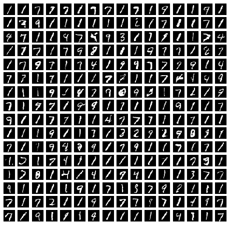

# gans-in-action-pytorch

This repository contains PyTorch implementations of examples from the
book [GANs in Action](https://www.manning.com/books/gans-in-action) by
*Jakub Langr* and *Vladimir Bok*.

The goal of the examples is not to provide one-to-one translations of
the Keras source code, but to implement the examples in an idiomatic
way in PyTorch. Examples for that is the usage of `Dataset` and
`DataLoader`.

## How to use the notebooks?

The provided Jupyter notebooks require Python 3.6 and were tested with
PyTorch 1.3. The easiest way to use these examples is to set up a
conda environment containing the follwoing packages.

```sh
$ conda install pytorch torchvision jupyter tqdm matplotlib
```

The package `tqdm` is used to have a nice progress bar during training
in the notebook. For plotting results and drawing images, the popular
`matplotlib` library is used.

## Deep Convolutional GAN (DCGAN)

Deep Convolutional GAN is a variant presented in the paper
[Unsupervised Representation Learning with Deep Convolutional
Generative Adversarial Networks](https://arxiv.org/abs/1511.06434) by
*Alec Radford*, *Luke Metz*, *Soumith Chintala*. This architecture
introduced convolutional layers to GANs as well as some best practices like
batch normalization. 

The example in PyTorch is provided
[here](chapter-4/Chapter_4_DCGAN.ipynb) and utilizes the MNIST dataset
to train the generator. A following image shows some results.



## Conditional GAN (CGAN)

Conditional GAN is a variant presented in the paper [Conditional
Generative Adversarial Nets](https://arxiv.org/abs/1411.1784) by
*Mehdi Mirza* and *Simon Osindero*. This architecture allows to direct
the generator what samples to create.

The provided example in the
notebook [here](chapter-8/Chapter_8_CGAN.ipynb) is using the MNIST
dataset to train a generator and allows to tell the generator what
number should be generated. The following images shows some results.


